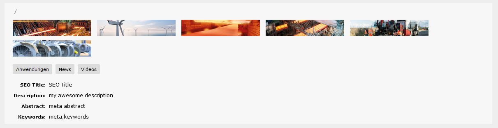
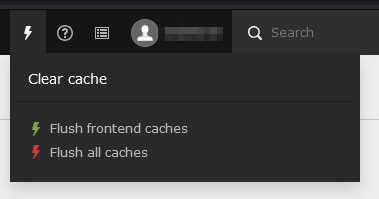

# mt_backend

Main Features:
- overview of page properties in Page Module
- Some QoL fixes for the backend 

Did you ever had to edit lots of content pages and review their resources, 
or just wanted to see the current slug directly?

Well, I do. And it annoyed the gentle carres out of me that I always had to click on "edit page" 
and then the corresponding tab over and over again. But no more!

This TYPO3 Extension provides a preview of page properties in the page module,
the following properties are shown, if available:
- slug
- resources media
- categories
- SEO title
- description
- abstract
- keywords.

QoL Fixes:
- hide clear cache explanation\
  
- reset of order of module docheader to [Columns|Languages  > languages ]\
  One wonders why that was changed anyway?!
  

and a some css touchup:

- content area background is a little darker
- better alignment of t3-page-column-header and t3-page-ce
  
- In development mode, the DB fieldnames are green instead of red [so much more friendly to the eyes, you have to see it to believe it!]
  
- Backend forms are a bit more compact
- removed unnecessary padding from gridelements
  

In the hope you may find it useful,
Feedback is always welcome please use the repository issues for that.

A big thank you to Markus Klein especially for helping me with so many little things I stopped counting^^)